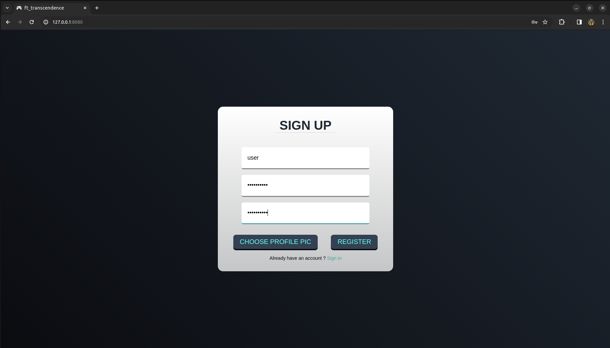
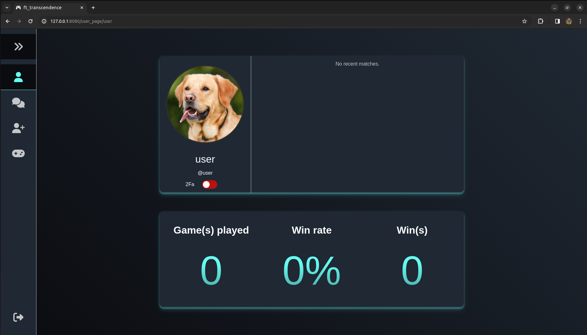
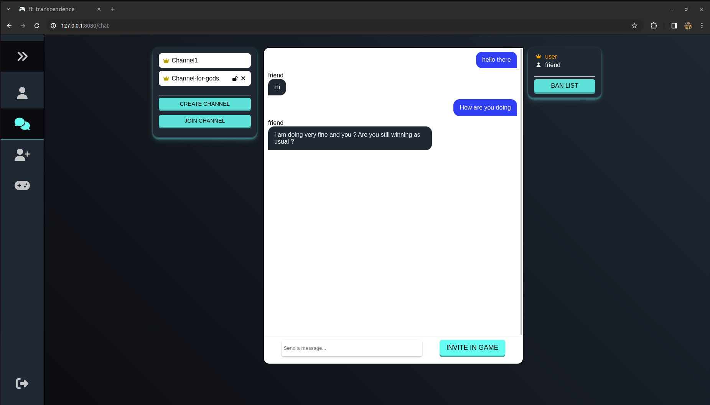
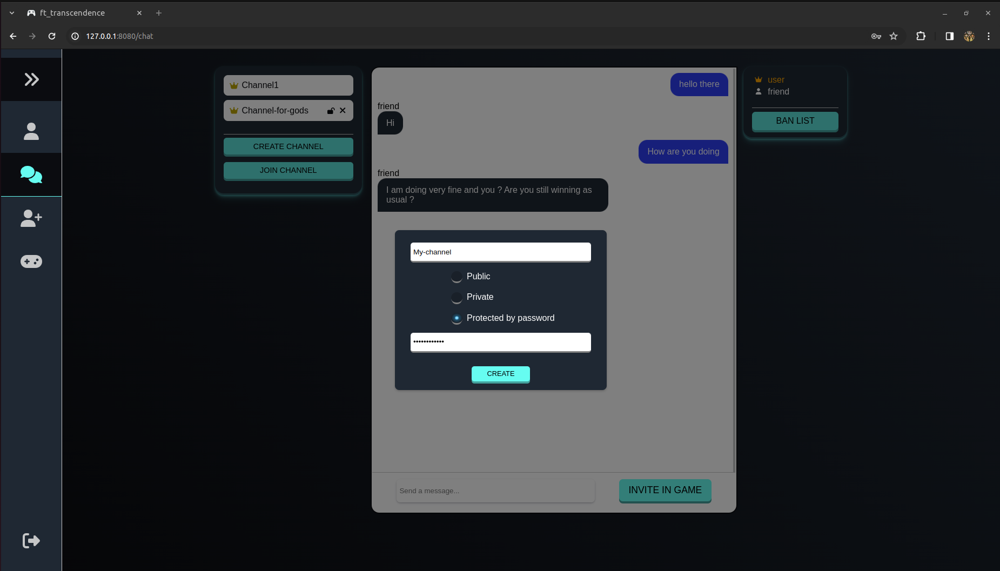
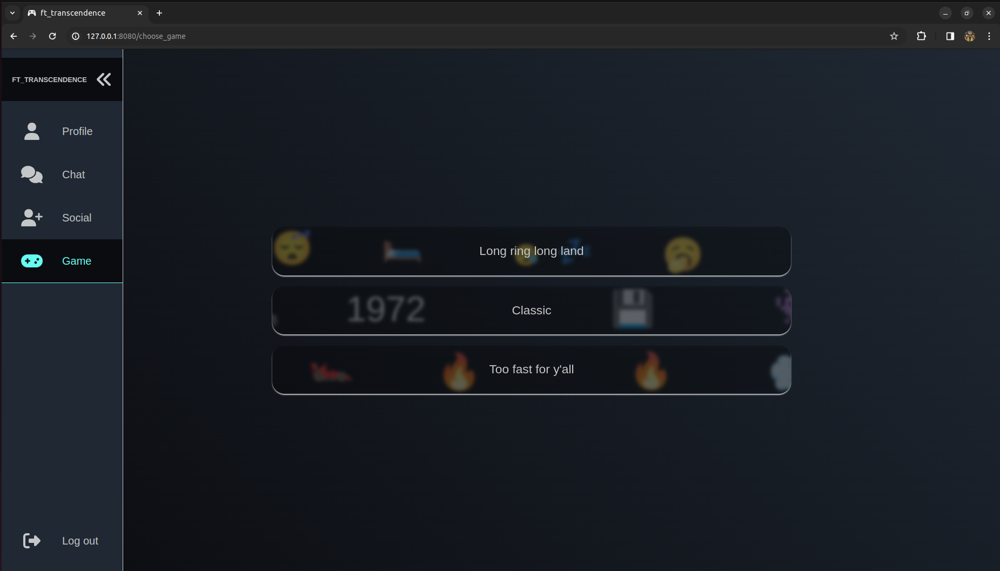
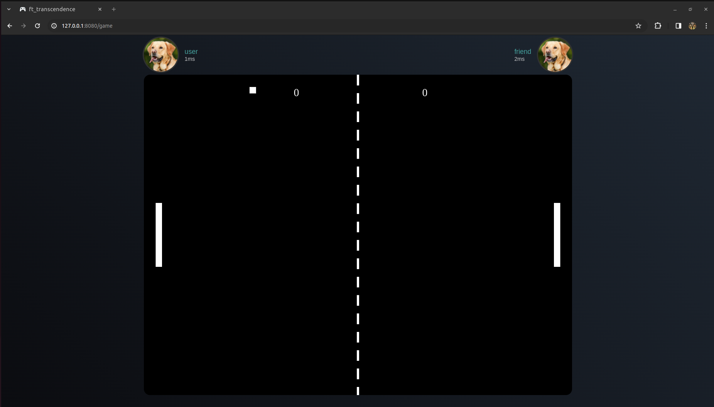
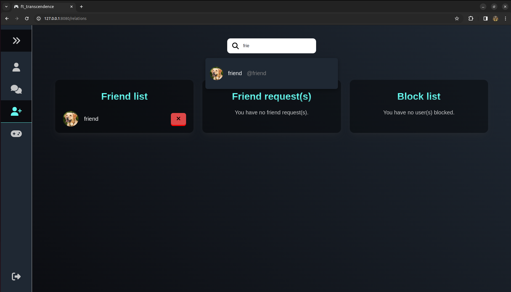
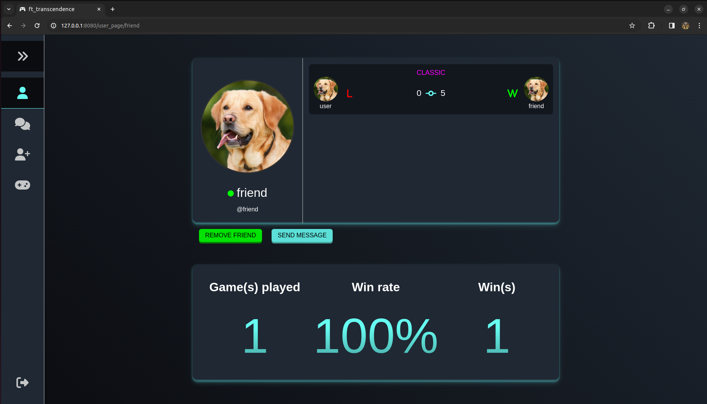

# Ft_transcendence
<a name="readme-top"></a>

<!-- TABLE OF CONTENTS -->
<details>
  <summary>Table of Contents</summary>
  <ol>
    <li>
      <a href="#about-the-project">About The Project</a>
      <ul>
        <li><a href="#built-with">Built With</a></li>
      </ul>
    </li>
    <li>
      <a href="#getting-started">Getting Started</a>
      <ul>
        <li><a href="#prerequisites">Prerequisites</a></li>
        <li><a href="#installation">Installation</a></li>
      </ul>
    </li>
    <li><a href="#Some screenshots">Some Screenshots</a></li>
    <li><a href="#Annex">Usage</a></li>
  </ol>
</details>


<!-- ABOUT THE PROJECT -->
## About The Project

This is a 42 project, the aim is to create a website, with authentification, chat system and pong

<p align="right">(<a href="#readme-top">back to top</a>)</p>


### Built With

* 
* 

<p align="right">(<a href="#readme-top">back to top</a>)</p>


<!-- GETTING STARTED -->
## Getting Started
### Prerequisites

* docker
* having no service running on port 3000, 5432, 8000,
	to verify:
  ```sh
  netstat -an | grep port_number
  ```


### Execution

   ```sh
   docker-copmpose up --build
   ```

<p align="right">(<a href="#readme-top">back to top</a>)</p>

## Some screenshots

* First we got the login page

* Our user page

* The chat / channel page

* Creating a new channel

* Launch game menu

* The game itself

* List of users / friends or blocking

* Our friend page (we can see he beat us in our single game)


## Annex

If you are a 42 student and you want to use the 42 Login method, dm me using my login: tibernot

<p align="right">(<a href="#readme-top">back to top</a>)</p>
